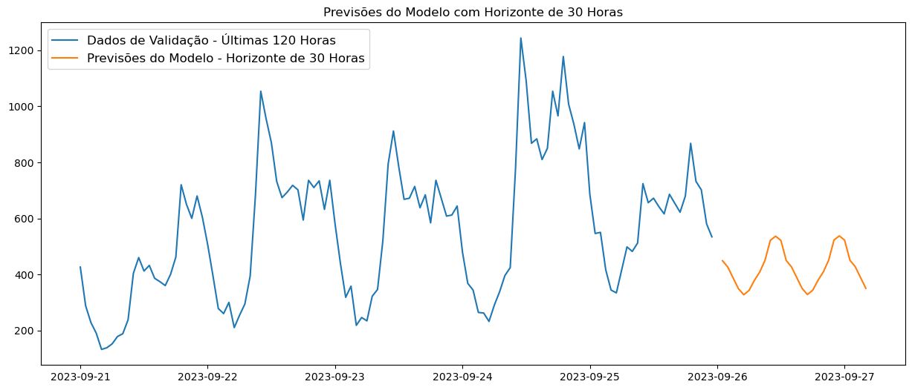

# 📊 Previsão de Usuários Ativos com Séries Temporais

Este projeto realiza a previsão do número de **usuários ativos** (HAU - Hours Active Users) em um sistema ao longo do tempo, utilizando técnicas de séries temporais para auxiliar o monitoramento e o planejamento estratégico.

---

## 🚀 Objetivo

- Construir um modelo preditivo capaz de estimar o número de usuários ativos em um web site nas próximas horas.
- Identificar padrões sazonais e tendências no comportamento dos usuários.
- Fornecer subsídios para decisões de marketing, suporte técnico e dimensionamento de infraestrutura.

---

## 🗂️ Dados

- **Fonte:** Dataset simulado para fins educacionais.
- **Período analisado:** Dados mensais de 2022-01 a 2025-06.
- **Variável alvo:**  `active_users`: número de usuários ativos no mês.

---

## 🔍 Pipeline do projeto

- **Análise exploratória (EDA):**
  - Visualização temporal dos usuários ativos.
  - Análise de tendência e possíveis sazonalidades.

- **Transformações e engenharia de dados:**
  - Aplicação do log para estabilizar variância.
  - Criação de features de lag para capturar dependências temporais.
  - Aplicação de testes estatísticos: Rolling Statistics, Dickey-Fuller.

- **Modelagem:**
  - Treinamento de um modelo **SARIMAX** para capturar padrão temporal.
  - Ajuste e validação via análise dos resíduos.

- **Forecast:**
  - Geração de previsões para os próximas horas.

---

## 📈 Resultados

- O modelo SARIMAX foi capaz de capturar adequadamente a tendência de crescimento no número de usuários ativos.
- Foram gerados gráficos de:
  - Evolução histórica dos usuários ativos.
  - Decomposição da série (tendência, sazonalidade e ruído).
  - Previsões futuras comparadas com dados recentes.


---

## 🛠️ Tecnologias e Bibliotecas

- **Linguagem:** Python (Jupyter Notebook)
- **Principais bibliotecas:**
  - pandas, numpy
  - matplotlib, seaborn
  - statsmodels (SARIMAX)

---

## ⚙️ Como executar

1. Clone o repositório:
   ```bash
   git clone https://github.com/jaquelinesfernandes/Predicting_ActiveUsers_TimeSeries.git


✍️ Autora
|          [Jaqueline Fernandes](https://github.com/jaquelinesfernandes)          |
